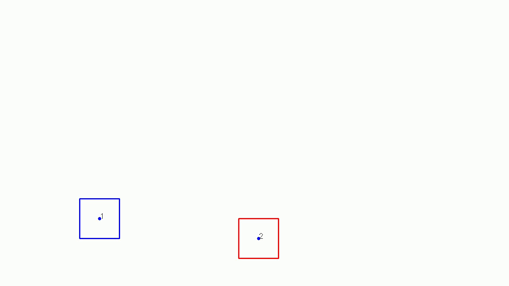

This is a Python implementation of Kalman filter based tracker in which IOU metric is used for data association. The code is inspired by [High-Speed Tracking-by-Detection Without Using Image Information](http://elvera.nue.tu-berlin.de/files/1517Bochinski2017.pdf) which uses Intersection Over Union metric as a mechanism to re-identify an objects across subsequent frames. There are two key assumptions in this study:

1. The bounding boxes (detections) in subsequent frames have significant overlap which is true if the used video has a high frame rate and we have a good detector.
2. There are very few missed detection leading to no or very few gaps.

These are very specific constraints on the quality of video and detector. To accommodate more noisy detections, including noise in bounding box height, width and center location, and missed detection.

To alleviate these limitations a Kalman Filter (KF) based [SORT](https://arxiv.org/pdf/1602.00763.pdf) tracker is ideal. The tracker's intrinsic state account for height, width, center_x, center_y (units=pixel). In this code I did not implement the Hungarian algorithm for optimal data assignment, but simply assigned the detection to the track with best IOU.

The main purpose of this code is to understand the working and performance of Kalman filter when implemented with IOU metric for tracking using detection boxes. In the following two tracking simulation I used a constant velocity and a constant acceleration model to check the performance on the kind of trajectories common in vehicle tracking application.

Tracking using constant velocity model 

Tracking using constant acceleration model 

It is seen that the constant velocity model is not able to keep up with the detection boxes which were generated by applying an acceleration in x and y directions in the image.

The next step is to add missed detection noise and noise in the bounding box sizes. In the reference case, we already observed that the constant velocity cannot keep up with the detections. So for the noisy case we will focus only on the constant acceleration model. To generate a noisy detection data, a missed detection probability of 20% was used and the detection box height and width can vary randomly by as much as 50%. The detection results are shown below:

Tracking noisy detection using constant acceleration model 

